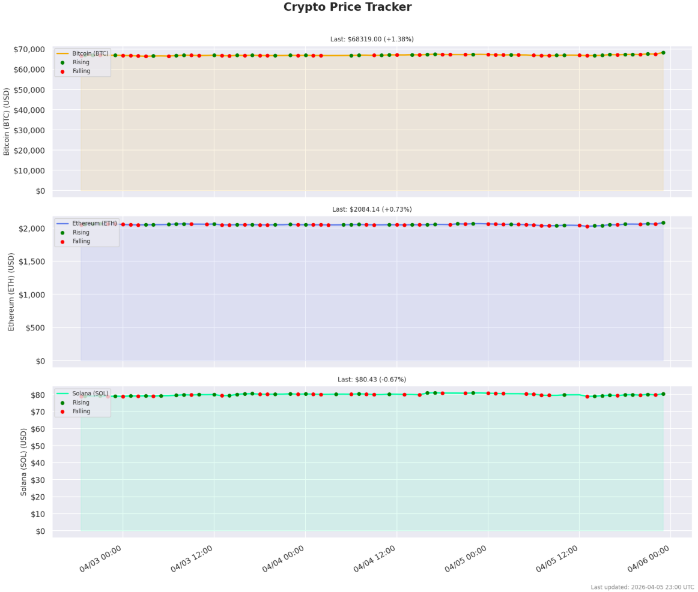

# Crypto Price Tracker

A containerized data pipeline that tracks Bitcoin, Ethereum, and Solana prices hourly using the CoinGecko API, stores data in AWS DynamoDB, and publishes a price chart to a public S3 website.

## Overview

This pipeline runs as a Kubernetes CronJob on an AWS EC2 instance. Every hour it fetches live crypto prices, records them to DynamoDB, generates a price trend chart, and uploads it to S3.

## Pipeline Architecture

CoinGecko API -> Python Script -> DynamoDB (storage) -> S3 (plot.png + data.csv)

## Data Source

CoinGecko free public API - no API key required.
Tracks: Bitcoin (BTC), Ethereum (ETH), Solana (SOL)

## Features

- Fetches price, market cap, 24h volume, and 24h change for 3 coins
- Detects price trend per run: Rising, Falling, Stable, or Initial
- Generates a 3-panel time series chart with trend markers
- Publishes plot.png and data.csv to a public S3 website bucket
- Runs automatically every hour via Kubernetes CronJob

## Live Plot

http://bqu3tr-coingecko-bucket.s3-website-us-east-1.amazonaws.com/plot.png

## Tech Stack

- Python 3.12
- boto3, requests, pandas, matplotlib, seaborn
- Docker / GHCR
- Kubernetes (K3S on AWS EC2)
- AWS DynamoDB
- AWS S3 static website hosting

## Project Structure

crypto-tracker/
  tracker.py        # main pipeline script
  Dockerfile        # container definition
  requirements.txt  # Python dependencies
  crypto-job.yaml   # Kubernetes CronJob manifest

## How It Works

1. CronJob fires every hour on the EC2 instance
2. Pod pulls the image from GHCR
3. tracker.py fetches prices from CoinGecko
4. Prices and trend labels are written to DynamoDB
5. Full price history is queried and plotted
6. plot.png and data.csv are uploaded to S3

## Price Chart Sample

